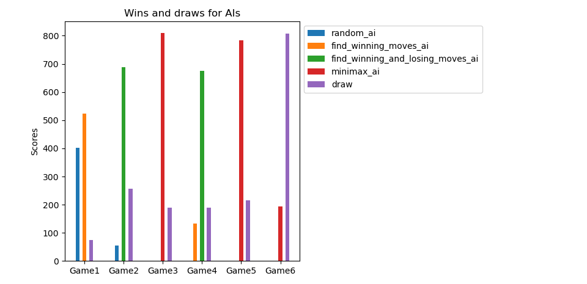
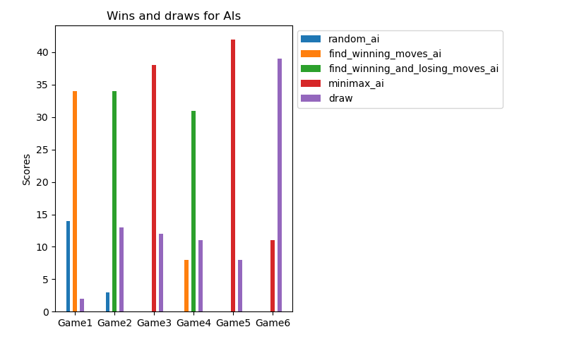

Play tic-tac-toe against human player or following (smart and non-smart) Artifical Intelligence agents

1. **random_ai**: randomly makes moves on the empty places of board

2. **find_winning_moves_ai**: plays for winning moves

3. **find_winning_and_losing_moves_ai**: plays for winning moves and blocks losing ones

4. **minimax_ai**: smart AI, implements minimax algorithm with alpha-beta pruning

To play, run
python tictactoe.py and
choose first and second players from the list of players.

repeated_battle_all.py compares 4 AI agents across 50 games. 

Minimax-AI never loses a game against themselves or any other AI!

In this figure, 
* Game 1 is random_ai vs find_winning_moves_ai
* Game 2 is random_ai vs find_winning_and_losing_moves_ai
* Game 3 is random_ai vs minimax_ai
* Game 4 is find_winning_moves_ai vs find_winning_and_losing_moves_ai
* Game 5 is find_winning_moves_ai vs minimax_ai
* Game 6 is find_winning_and_losing_moves_ai vs minimax_ai
 

This figure shows when minimax_ai is implemented with pruning.

